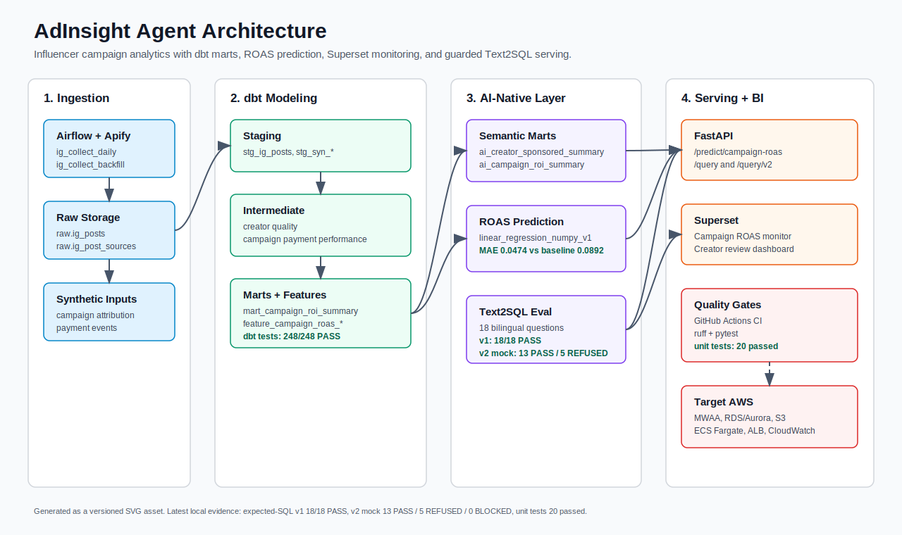

# AdInsight Agent

[](https://github.com/Y-E-O-N/adinsight-agent/actions/workflows/ci.yml)

> **인플루언서 광고 집행부터 결제 전환까지 추적하는 AI-Native 분석 플랫폼**
> An influencer campaign-to-payment analytics platform with ROAS prediction and a Text2SQL BI agent — built on Airflow, dbt, Superset, FastAPI, LangChain, pgvector, and LightGBM.

Instagram 인플루언서 광고 데이터를 수집·정제·모델링하고, 합성 결제 전환 이벤트를 결합해 캠페인 ROI/ROAS를 분석한다. 최종 목표는 Superset 대시보드, ROAS 예측 ML 모델, 자연어 질의를 처리하는 Text2SQL BI Agent, FastAPI 서빙 엔드포인트까지 연결된 포트폴리오형 데이터 플랫폼이다.

---

## TL;DR
- **도메인**: 인플루언서 광고 집행 → 게시물 성과 → 결제 전환 → 캠페인 ROI/ROAS 분석
- **스택**: Airflow 2.9 · Postgres 16 + pgvector · dbt-postgres 1.8 · Superset 4.x · FastAPI · LangChain · LightGBM · Gemini / Claude
- **차별점**: Apify 운영 자동화 + 가설 기반 합성 결제 데이터 + dbt 5레이어 + ROAS 예측 ML + Text2SQL Agent Exec Acc 측정
- **로컬 실행**: MacBook Apple Silicon, Docker Compose 한 방에 기동

---

## JD ↔ 산출물 매핑

| JD 항목 | 프로젝트 산출물 |
|---|---|
| AI Native 데이터 마트 설계·운영 | `dbt/models/ai_native/` (LLM 친화 비정규화 + dbt YAML semantic metadata) |
| 대규모 ETL 파이프라인 (Airflow) | `dags/` (수집 / 정제 / 집계 / 품질 / 리포트 DAG) + 백필 |
| AI 학습용 데이터 전처리 | `ai_native.ai_campaign_roi_features` + LightGBM ROAS 예측 feature set |
| Tableau / Superset 대시보드 | `dashboards/` (Campaign ROI / Creator Performance / Payment Conversion) |
| ML 모델 개발·평가 | `ml/` LightGBM ROAS 예측 모델, Walk-forward CV, RMSE/MAE, Feature Importance |
| API 연동·데이터 서빙 | `api/` FastAPI `/query`, `/predict` 엔드포인트 |
| Text2SQL BI Agent | `agent/` (LangChain schema-aware SQL Agent + 평가 프레임워크) |
| 데이터 리터러시 교육 | `docs/` 아키텍처·요청 플로우·동시성·면접 토크포인트 |
| 대용량 쿼리 최적화 | `metrics/query_optimization_log.md` (Before/After 기록) |
| Pandas + API 연동 | `data_generation/`, `dags/ingest_*.py` |
| LangChain · Vector DB 우대 | LangChain SQL Agent + pgvector |
| Superset 오픈소스 기여 우대 | `docs/superset_contribution_plan.md` |
| 글로벌 협업 경험 우대 | 다국가 모델링 (timezone · i18n · currency) + 영문 README 병행 |

---

## 빠른 시작 (Quick Start)

### 전제 조건
- Docker Desktop (메모리 12GB 할당 권장: Settings → Resources → Memory)
- Python 3.11, [uv](https://docs.astral.sh/uv/) 패키지 매니저

### 1단계 — 환경 변수 준비
```bash
cp .env.example .env
# .env 파일을 열어 비밀번호·시크릿 키 변경 (POSTGRES_PASSWORD, SUPERSET_SECRET_KEY 등)
```

### 2단계 — Python 의존성 설치 (개발 도구)
```bash
uv sync
```

### 3단계 — 포트 충돌 확인
```bash
# 아래 포트가 비어있어야 함: 5432 / 6379 / 8081 / 8088 / 5555 / 8000
lsof -i :5432,6379,8081,8088,5555,8000
```

### 4단계 — 스택 기동
```bash
time make up   # 최초 실행 시 이미지 pull 로 5~15분 소요
```

### 5단계 — 기동 확인
```bash
make ps        # 모든 서비스 STATUS = healthy 확인

# 각 UI 접속
#   Airflow  → http://localhost:8081  (admin / admin)
#   Superset → http://localhost:8088  (make superset-init 후 admin / admin)
#   Flower   → http://localhost:5555  (Celery 모니터링)
#   FastAPI  → http://localhost:8000  (ROAS prediction serving)
#   Postgres → localhost:5432         (make psql)
```

### 6단계 — Superset 초기화 (최초 1회)
```bash
make superset-init
```

### 7단계 — Smoke Test DAG 실행
```bash
# Airflow UI → DAGs → sample_smoke_test → Toggle ON → Trigger DAG
# Graph view 에서 select_one task 초록색 = 스택 정상
make airflow-cli cmd='dags trigger sample_smoke_test'
```

### 8단계 — FastAPI ROAS 예측 API 확인
```bash
# Docker Compose API 서비스 사용
curl -s http://127.0.0.1:8000/health

curl -s -X POST http://127.0.0.1:8000/predict/campaign-roas \
  -H 'Content-Type: application/json' \
  -d '{"campaign_id":"camp_000029"}'
```

ROAS 예측 응답 예시:
```json
{
  "campaign_id": "camp_000029",
  "model_name": "linear_regression_numpy_v1",
  "predicted_roas": 0.597425,
  "latency_ms": 23.495,
  "training_rows_used": 25,
  "scoring_snapshot_date": "2026-06-26",
  "feature_source": "features.feature_campaign_roas_scoring_set",
  "model_artifact_path": "agent/model_artifacts/campaign_roas_linear_v1.json",
  "known_limitation": "Fitted on 25 synthetic labeled campaign rows; benchmark artifact only."
}
```

자연어 질의 API:
```bash
curl -s -X POST http://127.0.0.1:8000/query \
  -H 'Content-Type: application/json' \
  -d '{"question":"Which campaigns have the highest ROAS?"}'

curl -s -X POST http://127.0.0.1:8000/query \
  -H 'Content-Type: application/json' \
  -d '{"question":"최신 ROAS 예측 모델의 MAE와 bias를 요약해줘."}'

curl -s -X POST http://127.0.0.1:8000/query/v2 \
  -H 'Content-Type: application/json' \
  -d '{"question":"Which campaigns have the highest ROAS?"}'
```

자연어 질의 응답 예시:
```json
{
  "question_id": "p5_q001",
  "matched_question": "Which campaigns have the highest ROAS?",
  "expected_model": "ai_native.ai_campaign_roi_summary",
  "row_count": 5,
  "rows": [
    {
      "campaign_id": "camp_000029",
      "campaign_name": "beauty_kr_conversion_000029",
      "roas": 0.5969125239376458,
      "net_payment_amount_krw": 500281.34
    }
  ],
  "latency_ms": 41.013,
  "mode": "deterministic_expected_sql_registry_v1"
}
```

로컬 FastAPI 서비스는 `api/` 코드와 `agent/model_artifacts/`의 모델 산출물을 연결하는 serving layer입니다. AWS로 옮기면 이 역할은 보통 ECS/Fargate 또는 Lambda 컨테이너 + ALB/API Gateway가 맡고, Postgres는 RDS/Aurora, 모델 산출물은 S3 또는 모델 registry로 분리합니다. 현재 구현은 포트폴리오용 로컬 skeleton이라 인증, rate limit, model registry versioning은 후속 hardening 대상입니다.

`/query`는 현재 LLM이 자유롭게 SQL을 생성하는 방식이 아니라, `agent/eval/text2sql_questions.yml`의 검증된 expected-SQL registry에서 질문을 매칭한 뒤 SELECT만 실행하는 deterministic v1입니다. 이 구조는 hallucination 위험을 줄이고, 이후 LLM SQL generation을 붙일 때 validator 기준선으로 사용할 수 있습니다.

Superset dashboard와 `/query`를 함께 보여주는 데모 흐름은 `docs/analysis/stage6_text2sql_superset_demo_runbook.md`에 정리했습니다.
Text2SQL 데모 GIF는 `docs/images/06_text2sql_demo.gif`, 실측 evidence는 `docs/analysis/stage6_text2sql_demo_evidence.md`에 저장했습니다.

AWS target architecture는 `docs/architecture/aws_target_architecture.md`, 인프라 skeleton은 `infra/aws/README.md`에 정리했습니다.
LLM SQL generation v2 설계와 provider adapter는 `docs/analysis/stage6_llm_text2sql_v2_design.md`에 정리했습니다. 현재 `/query/v2` 기본값은 mock provider이며 SQL generation boundary, validator, statement timeout, audit log를 검증합니다. v2 eval runner는 expected-SQL 18문항 중 mock answerable 13문항 PASS, 5문항 REFUSED, 0문항 BLOCKED를 기록합니다. v1 expected-SQL registry는 guardrail/eval baseline으로 유지합니다.

Text2SQL v2 provider 선택:
```bash
# 기본값: provider-free mock
TEXT2SQL_PROVIDER=mock

# 외부 Text2SQL gateway 연결 시
TEXT2SQL_PROVIDER=http_json
TEXT2SQL_PROVIDER_URL=https://example.com/text2sql
TEXT2SQL_PROVIDER_API_KEY=...
TEXT2SQL_PROVIDER_TIMEOUT_SECONDS=20
```

`http_json` provider는 `{question, schema_context}`를 POST하고 `{answerability, sql, expected_tables, reason}` JSON을 받는 내부 contract입니다. 실제 OpenAI/Bedrock 호출은 이 gateway 뒤에 붙이고, FastAPI와 eval runner는 같은 adapter boundary를 사용합니다. Gateway-first 설계와 로컬 실행 방법은 `docs/architecture/text2sql_gateway_architecture.md`에 정리했습니다.

Text2SQL gateway smoke:
```bash
uv run uvicorn text2sql_gateway.main:app --host 0.0.0.0 --port 8010

curl -s -X POST http://127.0.0.1:8010/text2sql/generate \
  -H 'Content-Type: application/json' \
  -d '{"question":"Which campaigns have the highest ROAS?","schema_context":"Allowed tables: ai_native.ai_campaign_roi_summary"}'
```

Gateway 경유 `/query/v2` smoke도 확인했습니다. `TEXT2SQL_PROVIDER=http_json`, `TEXT2SQL_PROVIDER_URL=http://127.0.0.1:8010/text2sql/generate`로 API를 실행했을 때 `/query/v2`는 mode `llm_generated_sql_v2_http_json`, rows `5`, top campaign `camp_000029`, latency `58.981ms`를 반환했습니다.

외부 LLM 없이 로컬 small model을 쓰는 경로도 gateway에 추가했습니다. `TEXT2SQL_GATEWAY_BACKEND=ollama`, `TEXT2SQL_OLLAMA_URL`, `TEXT2SQL_OLLAMA_MODEL`을 설정하면 gateway가 Ollama-compatible local model server를 호출하고, 모델 출력이 JSON contract를 만족하지 않으면 안전하게 `not_answerable`로 거절합니다.
`qwen2.5-coder:7b` 기반 local smoke도 확인했습니다. 초기에는 스키마 정보가 부족해 hallucinated column으로 실패했고, 이후 schema context에 실제 컬럼과 canonical query example을 추가해 `/query/v2`가 mode `llm_generated_sql_v2_http_json`, rows `5`, top campaign `camp_000029`, latency `4800.432ms`를 반환했습니다.

로컬 모델 교체 기준도 추가했습니다. `docs/analysis/stage6_text2sql_local_model_eval_rubric.md`는 Spider/BIRD 계열 Text2SQL 평가 관행을 바탕으로 `Exec Acc`, 전체 pass coverage, unsafe block rate, p95 latency를 합산한 0~100점 `model_score`를 정의합니다. `agent/eval/run_text2sql_v2_eval.py`는 이제 summary에 `model_score`를 포함하므로 `qwen2.5-coder:7b`와 다른 Ollama 모델을 같은 18문항 기준으로 비교할 수 있습니다.

API request/response examples는 `docs/api/query_v2_request_response_examples.md`, 3-5분 데모 스크립트는 `docs/demo_script_3min.md`, 면접 토크포인트는 `docs/interview_talking_points.md`에 정리했습니다.
이력서 bullet 초안은 `docs/resume_bullets.md`에 정리했습니다.

### 종료
```bash
make down          # 컨테이너 중지 (볼륨 유지)
make clean-confirm # 컨테이너 + 볼륨 삭제 (데이터 초기화)
```

---

## 아키텍처 (요약)



```
[Ingestion]   Kaggle CSV / 공개 API / SDV 합성  ─┐
                                                   ▼
[Storage]     Postgres schemas: raw → staging → intermediate → marts → ai_native
                                                   │
                                  ┌────────────────┼─────────────────────┐
                                  ▼                ▼                     ▼
[Consumption] Superset 대시보드   Text2SQL Agent   Weekly LLM Report DAG
                                       │
                                       ▼
                               pgvector (schema embedding store)
```

상세 다이어그램: `docs/adinsight_project_blueprint.md` (섹션 3-3)

---

## 폴더 구조 (요약)

```
adinsight-agent/
├── CLAUDE.md                  # Claude Code 컨텍스트
├── Makefile
├── pyproject.toml             # uv
├── docker-compose.yml         # (Phase 1)
├── infra/{airflow,superset,postgres}
├── data_generation/           # SDV / Faker 합성 데이터
├── dags/                      # Airflow DAG
├── dbt/                       # dbt-postgres
│   └── models/{staging,intermediate,marts,ai_native}
├── agent/                     # Text2SQL BI Agent
├── dashboards/                # Superset YAML export
├── metrics/                   # 포트폴리오 지표 자동 기록
├── reports/                   # 주간 LLM 리포트 (gitignore)
├── docs/
│   ├── adinsight_project_blueprint.md   # ⭐ 마스터 설계서
│   └── session_log/                      # 세션별 작업 로그
└── tests/{unit,integration}
```

전체 트리: 블루프린트 섹션 4

---

## Phase 진행 상황

| Phase | 내용 | 상태 |
|---|---|---|
| 0~3 | 기존 작업: Docker/Airflow/Postgres/dbt/Superset/ai_native/eval YAML 초안 | ✅ |
| P | 포지셔닝 재정립: A+C 전략 문서 정렬, ADR 003 | ✅ |
| 2B | Apify 운영 등급 자동화: watermark, freshness, backfill | ✅ |
| 2C | 합성 결제 데이터 생성: creator/campaign/post metrics/payment events | ✅ |
| 3B | dbt 모델 확장: campaign ROI, payment conversion, ML feature store | ✅ |
| 4B | ROAS 예측 ML 모델: baseline + NumPy model comparison + artifact export | ✅ |
| 5B | Text2SQL Agent 실구현: deterministic expected-SQL registry v1 + evaluator | 🟡 |
| 5C | LLM SQL generation v2: validator + mock harness + eval baseline | 🟡 |
| 6B | FastAPI 엔드포인트: `/query`, `/predict` | ✅ |
| 7B | Superset 대시보드 + Text2SQL 데모 연결 | 🟡 |
| 8B | AWS target architecture + IaC skeleton | 🟡 |
| 8C | CI/CD: GitHub Actions `ruff check` + `pytest -q` | ✅ |
| 9B | 문서화 + 데모 준비: 토크포인트, 데모 영상, README 최종화 | ⬜ |

---

## 포트폴리오 메트릭 (자동 기록)

`metrics/portfolio_metrics.md` 참조. Phase별 행 수·dbt 테스트 커버리지·쿼리 최적화 비율·Text2SQL Execution Accuracy 등이 자동 누적됩니다.

---

## 세션 로그
모든 작업 세션은 `docs/session_log/`에 기록됩니다. 세션 시작 시 가장 최신 로그를 확인하세요.

---

## References
- Airflow: <https://airflow.apache.org/docs/>
- dbt: <https://docs.getdbt.com/>
- Superset: <https://superset.apache.org/docs/intro/>
- LangChain SQL: <https://python.langchain.com/docs/use_cases/sql/>
- pgvector: <https://github.com/pgvector/pgvector>
- SDV: <https://sdv.dev/>

---

## License
MIT (see `LICENSE`). 공개 데이터셋 출처·라이선스는 각 적재 DAG 코드 헤더에 명시.
