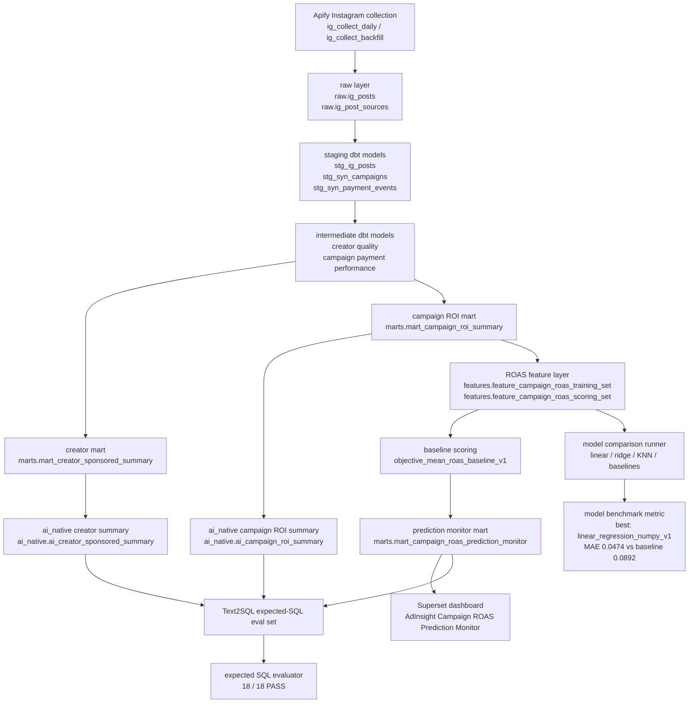
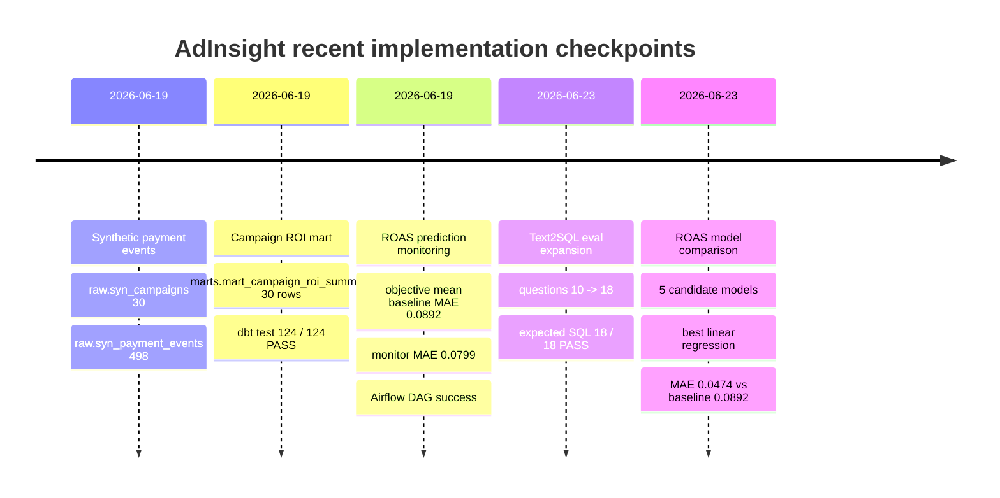

# AdInsight Current Architecture Visualization

**Date**: 2026-06-23
**Scope**: Phase 2B through Phase 6 checkpoint
**Purpose**: README / portfolio draft용 현재 구현 흐름 시각화

## 1. End-to-End Flow

## 2. Recent Checkpoint Timeline

## 3. Portfolio Summary Table

| Layer | Current implementation | Evidence |
|---|---|---|
| Data ingestion | Apify daily/backfill DAGs | `ig_collect_daily`, `ig_collect_backfill`, `metrics/run_results.jsonl` |
| Warehouse modeling | raw → staging → intermediate → marts | `dbt/models/` |
| AI-native mart | creator and campaign semantic summaries | `dbt/models/ai_native/` |
| ROAS prediction | baseline scoring + model comparison runner | `agent/eval/run_campaign_roas_scoring.py`, `agent/eval/run_campaign_roas_model.py` |
| Monitoring | prediction monitor mart + Superset dashboard | `marts.mart_campaign_roas_prediction_monitor`, `docs/images/05_campaign_roas_prediction_monitor.png` |
| Text2SQL eval | 18 expected-SQL questions | `agent/eval/text2sql_questions.yml`, `18/18 PASS` |
| Portfolio metrics | JSONL append-only evidence | `metrics/run_results.jsonl` |

## 4. Key Numbers

| Metric | Value |
|---|---:|
| Text2SQL expected-SQL questions | 18 |
| Expected-SQL evaluator result | 18 / 18 PASS |
| ROAS model training rows | 25 |
| Objective mean baseline MAE | 0.0892 |
| Best ML v1 MAE | 0.0474 |
| Best ML v1 model | `linear_regression_numpy_v1` |
| Prediction monitor MAE | 0.0799 |
| Latest committed model checkpoint | `66e9c13 Add campaign ROAS model comparison` |

## Known Limitations

- Current model benchmark uses only 25 synthetic labeled campaign rows, so it is benchmark evidence, not production performance evidence.
- LightGBM, XGBoost, and CatBoost are intentionally deferred until more labeled campaign rows exist.
- Mermaid diagrams are source diagrams. Export to SVG/PNG separately before embedding in a polished README or PDF.

