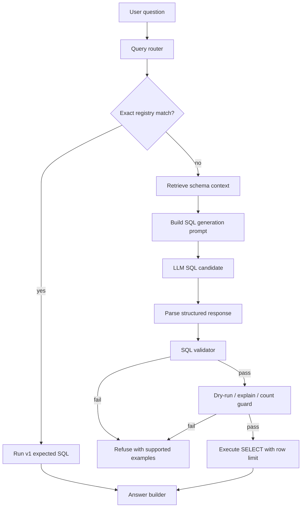

# Stage 6 LLM Text2SQL v2 Design

**작성일**: 2026-07-04
**상태**: v2.0 mock harness, `/query/v2` endpoint, and v2 eval runner implemented; provider integration not implemented
**기준선**: deterministic `/query` v1 with expected-SQL registry

## 1. 목적

현재 `/query` v1은 `agent/eval/text2sql_questions.yml`의 curated question과 exact-match한 expected SQL만 실행한다. 이 방식은 안전하지만, registry에 없는 자연어 질문에는 답하지 못한다.

v2의 목적은 LLM SQL generation을 붙이되, v1에서 만든 guardrail과 evaluator를 유지해 hallucination과 destructive SQL 실행 위험을 낮추는 것이다.

핵심 원칙:

- LLM은 SQL 후보를 생성할 수 있다.
- API는 생성 SQL을 그대로 믿지 않는다.
- 실행 전 validator가 SQL shape, 허용 schema/table, row limit, statement timeout을 검사한다.
- expected-SQL evaluator는 v2 regression benchmark로 계속 사용한다.
- v2 실패 시 v1 registry match 또는 refusal로 fallback한다.

## 2. v1 기준선

현재 구현:

- endpoint: `POST /query`
- mode: `deterministic_expected_sql_registry_v1`
- source: `agent/eval/text2sql_questions.yml`
- matcher: normalized exact match by question text or question id
- validator:
  - only `SELECT`
  - blocked tokens: `insert`, `update`, `delete`, `drop`, `alter`, `truncate`, `create`, `grant`, `revoke`, `copy`
  - max result rows: `50`
- evidence:
  - English `p5_q001`, rows `5`
  - Korean `p5_q008`, rows `1`
  - evaluator `18/18 PASS`

v2는 이 구조를 제거하지 않고, v1을 safe fallback과 benchmark로 둔다.

## 3. Target v2 Flow



## 4. Components

| Component | Proposed file | Responsibility |
|---|---|---|
| Query router | `agent/text2sql/router.py` | Try v1 exact match first, then v2 generation if enabled. |
| Schema catalog | `agent/text2sql/schema_catalog.py` | Store allowed schemas/tables/columns and business descriptions. |
| Prompt builder | `agent/text2sql/prompts.py` | Build compact prompt from schema context and examples. |
| LLM client adapter | `agent/text2sql/llm_client.py` | Provider boundary for OpenAI/Bedrock/local mock. |
| SQL validator | `agent/text2sql/validator.py` | Validate SELECT-only, allowed tables, row limit, blocked tokens. |
| v2 executor | `agent/text2sql/generator.py` | Generate, validate, execute, and return result object. |
| Eval runner | `agent/eval/run_text2sql_v2_eval.py` | Compare v2 generated SQL against expected-SQL question set. |

## 5. Schema Scope

v2 should start with the smallest useful schema set:

| Schema/table | Why included |
|---|---|
| `ai_native.ai_campaign_roi_summary` | Campaign ROI self-service questions. |
| `marts.mart_campaign_roas_prediction_monitor` | Model monitoring and prediction error questions. |
| `ai_native.ai_creator_sponsored_summary` | Existing creator sponsored review questions. |

Do not expose `raw`, `staging`, or broad `intermediate` tables to v2 initially. They contain lower-level implementation details and increase SQL generation risk.

## 6. Validator Requirements

v2 SQL must pass all checks before execution:

1. Starts with `SELECT` or `WITH`.
2. Contains no blocked write/admin tokens.
3. References only allowlisted schemas/tables.
4. Does not contain multiple statements.
5. Includes explicit `LIMIT` for non-aggregate queries.
6. Uses max result rows `50` even if SQL requests more.
7. Runs with statement timeout.
8. Rejects comments that try to smuggle instructions.

Future hardening:

- Use `sqlglot` for structured parsing.
- Compare selected columns against allowlisted column catalog.
- Add SQL hash and generated mode to audit logs.

## 7. Prompt Contract

The LLM should return a structured JSON object, not free text:

```json
{
  "answerability": "answerable",
  "sql": "select ... limit 10",
  "expected_tables": ["ai_native.ai_campaign_roi_summary"],
  "reason": "Uses campaign ROI summary because the question asks for ROAS by campaign."
}
```

If not answerable:

```json
{
  "answerability": "not_answerable",
  "sql": null,
  "expected_tables": [],
  "reason": "The exposed schema does not contain ad spend by channel."
}
```

The API should only execute when:

- `answerability = answerable`
- `sql` is non-empty
- validator passes
- dry-run guard passes

## 8. API Response Changes

v2 should keep the current `QueryResponse` fields and add optional metadata later:

| Field | v1 | v2 |
|---|---|---|
| `mode` | `deterministic_expected_sql_registry_v1` | `llm_generated_sql_v2` |
| `question_id` | registry id | nullable or generated eval id |
| `matched_question` | registry question | nullable |
| `sql` | expected SQL | generated SQL after validation |
| `known_limitation` | curated only | generated SQL can still be wrong; validator reduces risk |

For compatibility, initial v2 can expose a separate endpoint:

- `POST /query/v2`

After evaluation is stable, `/query` can route:

1. v1 exact match
2. v2 generation
3. refusal

## 9. Evaluation Plan

Use `agent/eval/text2sql_questions.yml` as the first regression set.

Metrics:

| Metric | Definition |
|---|---|
| Exec Acc | Generated SQL returns same row count and key values as expected SQL. |
| Refuse Rate | Share of questions v2 refuses. |
| Unsafe Block Rate | Generated SQL rejected by validator. |
| p50/p95 latency | End-to-end generation + validation + execution latency. |
| Cost/query | Provider cost per successful query. |
| Language split | EN vs KO performance. |

Minimum pass gate before demo:

- Expected-SQL regression set runs end-to-end.
- No destructive SQL reaches execution.
- All SQL references allowlisted tables only.
- v1 exact-match questions still pass `18/18`.

## 10. Implementation Phases

### Phase v2.0 — Mock LLM Harness

Goal: build the v2 interface without external API dependency.

- Add provider interface.
- Add deterministic mock provider returning SQL for 2 known questions.
- Add validator module.
- Add tests for unsafe SQL rejection.

### Phase v2.1 — Provider Integration

Goal: connect a real LLM provider behind the interface.

- Add environment-driven provider selection.
- Add JSON response parsing.
- Add timeout and retry policy.
- Keep `POST /query/v2` disabled unless API key exists.

### Phase v2.2 — Eval and Demo

Goal: measure quality before promoting.

- Add `agent/eval/run_text2sql_v2_eval.py`.
- Save eval results to `metrics/run_results.jsonl`.
- Compare v1 exact-match vs v2 generated SQL.
- Document failure cases.

### Phase v2.3 — Router Promotion

Goal: let `/query` use v2 safely.

- Try v1 registry exact-match first.
- If no match and v2 enabled, generate SQL.
- If v2 fails validation, return refusal with supported examples.

## 11. Local vs AWS Mapping

| Local v2 component | AWS target |
|---|---|
| LLM client adapter | Bedrock or OpenAI-compatible provider behind Secrets Manager |
| Schema catalog file | S3 versioned artifact or generated from dbt manifest |
| Eval outputs | S3 audit log + CloudWatch metrics |
| `/query/v2` API | ECS Fargate FastAPI endpoint |
| SQL audit logs | CloudWatch Logs or OpenSearch |

## 12. Known Limitations

- v2 is not implemented yet.
- Current dependency set does not include LangChain, OpenAI SDK, Bedrock SDK, or sqlglot.
- LLM-generated SQL can be syntactically valid but semantically wrong, so expected-SQL eval is mandatory.
- Korean query quality depends on prompt examples and schema synonym coverage.
- The synthetic campaign/payment data limits the business realism of generated answers.

## 13. v2.0 Mock Harness Status

Implemented:

- `agent/text2sql/validator.py`
- `agent/text2sql/llm_client.py`
- `agent/text2sql/generator.py`
- `tests/unit/test_text2sql_v2.py`

Verified:

- `uv run ruff check agent/text2sql tests/unit/test_text2sql_v2.py` -> pass
- `uv run pytest -q` -> `10 passed`

Not implemented yet:

- real LLM provider integration
- SQL parser dependency such as `sqlglot`

## 14. `/query/v2` Mock Endpoint And Eval Status

Implemented:

- `POST /query/v2`
- response schema: `QueryV2Response`
- mock provider: `MockSqlGenerationClient`
- eval runner: `agent/eval/run_text2sql_v2_eval.py`
- validation metadata in response:
  - `expected_tables`
  - `validation_tables`
  - `validation_limit`
  - `reason`

Verified:

- `uv run ruff check api tests/unit/test_api.py agent/text2sql tests/unit/test_text2sql_v2.py` -> pass
- `uv run pytest -q` -> `12 passed`
- `set -a; source .env; set +a; POSTGRES_HOST=localhost uv run python agent/eval/run_text2sql_v2_eval.py`
  - total `18`
  - passed `8`
  - failed `0`
  - refused `10`
  - blocked `0`
  - answerable exec_acc `1.0`
  - refuse_rate `0.5556`

Hardening implemented:

- `statement_timeout` is set before generated SQL execution.
- `/query/v2` writes best-effort audit records to `logs/text2sql_audit.jsonl`.
- `/query/v2` has explicit success, refused, blocked, and unexpected-error response handling.
- API tests cover `200`, `400`, `404`, and `500` paths.

## 15. Next Concrete Step

Connect a richer provider after keeping the same eval gate:

- keep `agent/eval/run_text2sql_v2_eval.py`
- add a provider adapter behind `SqlGenerationClient`
- compare provider output against `agent/eval/text2sql_questions.yml`
- record Exec Acc, Refuse Rate, Unsafe Block Rate, p50/p95 latency
