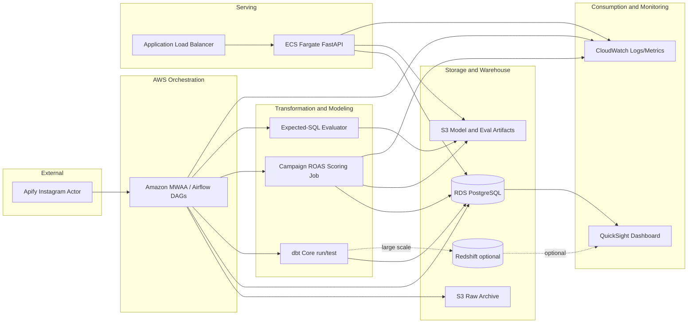

# AWS Target Architecture for AdInsight

**작성일**: 2026-07-01
**상태**: Target architecture draft, not deployed
**기준 구현**: local Docker Compose + Airflow + Postgres + dbt + Superset + FastAPI `/predict`, `/query`

## 1. 목적

현재 AdInsight는 로컬에서 end-to-end 데이터 플랫폼의 축을 이미 갖췄다.

- Apify 기반 Instagram 수집과 raw lineage 보존
- synthetic campaign/payment event 생성
- dbt staging/intermediate/marts/features/ai_native 레이어
- campaign ROAS prediction scoring
- Superset monitoring dashboard
- FastAPI `/predict/campaign-roas`, `/query`
- deterministic Text2SQL expected-SQL registry/evaluator

이 문서는 이 로컬 구현을 AWS managed service로 옮길 때의 목표 구조를 정리한다. 지금 단계의 목표는 실제 배포가 아니라, 면접에서 “이 로컬 구현을 운영 환경으로 옮기면 어떤 경계와 서비스를 선택할 것인가”를 설명할 수 있게 만드는 것이다.

## 2. One-Sentence Architecture

> AdInsight는 MWAA가 ingestion/dbt/scoring workflow를 orchestration하고, RDS 또는 Redshift에 raw-to-mart 데이터를 저장하며, ECS Fargate의 FastAPI service가 ROAS prediction과 deterministic Text2SQL query를 serving하고, QuickSight와 CloudWatch가 BI/운영 모니터링을 담당하는 AWS 데이터 플랫폼으로 확장할 수 있다.

## 3. Target Component Map

| Local component | Current role | AWS target | Why |
|---|---|---|---|
| Docker Compose | local service orchestration | ECS/Fargate for API, MWAA for Airflow | API serving과 workflow orchestration을 분리한다. |
| Airflow scheduler/webserver/worker | ingestion, dbt, scoring DAG | Amazon MWAA | 기존 DAG 구조와 가장 직접적으로 대응된다. |
| Apify client in DAG | Instagram post collection | MWAA task or ECS scheduled task | 외부 API 호출은 workflow task로 유지한다. |
| Postgres `raw` schema | immutable raw storage | RDS PostgreSQL first, S3 raw archive optional | 현재 SQL compatibility를 유지하면서 원본 보존을 강화한다. |
| Postgres marts/features/ai_native | warehouse/mart/feature layer | RDS PostgreSQL for portfolio scale, Redshift for larger scale | 현재 데이터 규모는 RDS가 현실적이고, 대규모 확장은 Redshift로 설명한다. |
| dbt Core | transformation and tests | dbt Core on MWAA/ECS, or dbt Cloud | 현재 `dbt run/test` 계약을 운영 workflow로 옮긴다. |
| Python scoring scripts | batch prediction refresh | MWAA task, ECS task, or SageMaker Processing | model scoring은 batch job으로 유지한다. |
| JSON model artifact | local model artifact | S3 versioned artifact | API와 scoring job이 같은 artifact를 참조한다. |
| FastAPI `/predict`, `/query` | serving layer | ECS Fargate + ALB, optional API Gateway | 컨테이너 기반 serving이 현재 코드와 가장 자연스럽다. |
| Superset dashboard | BI and monitoring dashboard | QuickSight dashboard | managed BI로 운영 부담을 줄인다. |
| `metrics/run_results.jsonl` | local run metrics | CloudWatch metrics/logs + S3 audit log | DAG/API/model/eval 결과를 검색 가능한 운영 로그로 전환한다. |
| `.env` | local secrets | Secrets Manager + IAM task roles | secret file commit risk를 제거한다. |

## 4. Logical Architecture

## 5. Runtime Flows

### 5.1 Daily Data and Scoring Flow

1. MWAA runs the daily collection DAG.
2. The DAG calls Apify and writes immutable records to `raw.ig_posts` and `raw.ig_post_sources`.
3. dbt runs staging/intermediate/marts/features models.
4. dbt tests enforce schema and relationship contracts.
5. The scoring task loads the latest feature table and model artifact.
6. Prediction rows are written to `marts.mart_campaign_roas_prediction_monitor`.
7. CloudWatch records DAG status, row counts, MAE, bias, and latency.
8. QuickSight reads the latest mart for operator-facing monitoring.

### 5.2 `/predict/campaign-roas` Serving Flow

1. Client sends `campaign_id` to ALB.
2. ALB routes to ECS Fargate FastAPI.
3. API loads or caches the versioned model artifact from S3.
4. API reads the latest campaign feature row from RDS.
5. API returns predicted ROAS, model name, scoring snapshot date, and known limitation.

### 5.3 `/query` Serving Flow

1. Client sends a natural-language analytics question to `/query`.
2. FastAPI normalizes the question and matches it against the versioned expected-SQL registry.
3. API validates that the SQL is SELECT-only and blocks destructive tokens.
4. API executes the SQL against RDS marts or ai_native tables.
5. API returns `question_id`, SQL, rows, answer, latency, mode, and limitation.

현재 v1은 LLM free-form SQL generation이 아니다. 이 registry-based flow는 이후 Bedrock/LangChain 기반 v2를 붙이더라도 regression baseline과 safety gate로 유지한다.

## 6. Deployment Boundary

| Boundary | Deployable unit | Notes |
|---|---|---|
| Workflow | MWAA environment + DAG S3 bucket | Airflow DAG code, dbt commands, scoring scripts. |
| Warehouse | RDS PostgreSQL first | Current SQL works with minimum migration. |
| Artifact | S3 bucket with versioned prefixes | model artifact, expected-SQL registry, evaluator output. |
| API | ECS Fargate service + ALB | FastAPI container, health check, `/predict`, `/query`. |
| BI | QuickSight dataset/dashboard | Superset assets become rebuild instructions or exported dashboard reference. |
| Observability | CloudWatch logs/metrics | API latency, DAG success, dbt failures, model MAE/bias. |

## 7. Security and Governance

| Concern | Target control |
|---|---|
| Secrets | Store Apify token and DB password in Secrets Manager. |
| API access | ALB security group allowlist first; Cognito/API Gateway authorizer later. |
| Database access | IAM-scoped task roles plus least-privilege DB user per workload. |
| SQL safety | Keep SELECT-only validation for `/query`; add statement timeout and row limit. |
| Raw preservation | Keep raw schema append/upsert semantics; optionally archive raw payloads to S3. |
| Artifact versioning | S3 versioning and explicit model/registry version fields in API response. |
| Auditability | Store `question_id`, SQL hash, latency, row count, and caller metadata in logs. |

## 8. Observability Metrics

| Area | Metric |
|---|---|
| Ingestion | collected rows, inserted rows, updated rows, freshness date, Apify error count |
| dbt | model run status, test pass/fail count, failing model/test names |
| Scoring | prediction rows, MAE, bias, model name, model artifact version |
| `/predict` | p50/p95 latency, 4xx/5xx rate, campaign not found count |
| `/query` | p50/p95 latency, no-match rate, blocked SQL count, question_id distribution |
| BI | dashboard refresh timestamp, latest scoring snapshot date |

## 9. Cost-Control Strategy

이 프로젝트는 포트폴리오 목적이므로 실제 AWS 배포 시 비용 통제가 중요하다.

| Expensive choice | Lower-cost first step |
|---|---|
| Always-on Redshift | RDS PostgreSQL or Redshift Serverless with strict pause/usage control |
| Always-on large ECS tasks | Small Fargate task count 1, scale-to-zero alternative with Lambda container later |
| Full MWAA environment | Documented target first; local Airflow remains source of truth until deployment |
| SageMaker endpoint | Batch scoring via ECS/MWAA; S3 artifact loaded by FastAPI |
| Streaming stack | Keep daily batch; document Kinesis/MSK as future payment-event extension |

## 10. Migration Phases

### Phase A — Architecture and IaC Skeleton

- Create `infra/aws/README.md`.
- Define service boundaries and environment variables.
- Do not deploy yet.

### Phase B — Container and Artifact Readiness

- Build FastAPI container locally.
- Make model artifact path configurable as local file or S3 URI.
- Add API startup check for artifact version.

### Phase C — Minimal AWS PoC

- Push API image to ECR.
- Deploy ECS Fargate service behind ALB.
- Use RDS PostgreSQL snapshot or small seeded DB.
- Keep Airflow local initially.

### Phase D — Workflow Migration

- Move DAGs/dbt/scoring to MWAA or ECS scheduled tasks.
- Write run metrics to CloudWatch and S3.
- Keep expected-SQL evaluator as CI/MWAA validation step.

### Phase E — BI Migration

- Recreate Superset monitor in QuickSight.
- Document dataset grain, metrics, and refresh cadence.

## 11. Interview Talking Points

- “I did not jump straight to cloud deployment. I first made the local system observable and reproducible, then mapped each runtime boundary to an AWS service.”
- “The `/query` endpoint is intentionally deterministic in v1. It prevents SQL hallucination and gives me an expected-SQL regression baseline before adding LLM SQL generation.”
- “For this domain, daily batch scoring is a better first architecture than streaming. Payment-event streaming can be a future extension, but campaign ROAS monitoring does not require it on day one.”
- “I would start with RDS PostgreSQL for compatibility and cost, then move analytics-heavy marts to Redshift only if query volume or data size justifies it.”

## 12. Known Limitations

- AWS services are not deployed yet.
- Current model artifact is trained on 25 synthetic labeled campaign rows, so performance metrics are benchmark evidence only.
- `/query` is deterministic expected-SQL registry v1, not free-form LLM SQL generation.
- Superset to QuickSight is documented as a target migration, not implemented.
- Real authentication, rate limiting, and tenant isolation are future hardening tasks.
